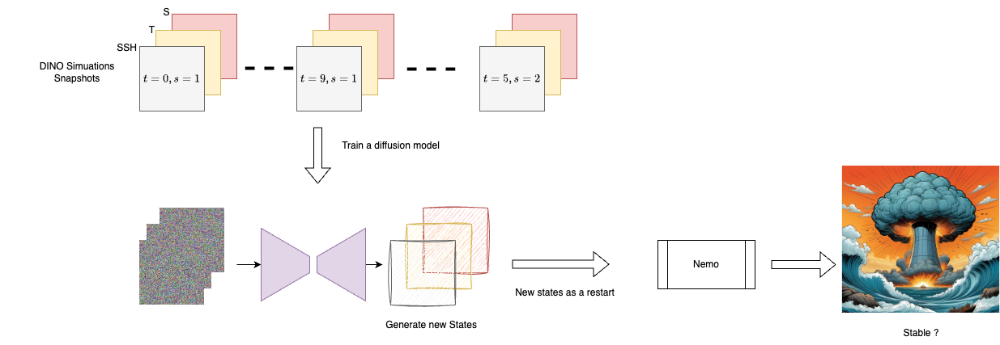

# DINO Fusion 

Training a diffusion model on DINO data to generate new states and test if they are stable in NEMO. 

Varaibles we want to generate : 

- SSH (2D)
- T (3D)
- S (3D)

Resolutions :

- 1 deg :   `199 * 62 *36 `
- 1/4 deg : `797 * 242 * 36`

--> Data in `/gpfsstore/rech/omr/uym68qx/nemo_output/DINO/Dinoffusion` on Jeanzay

