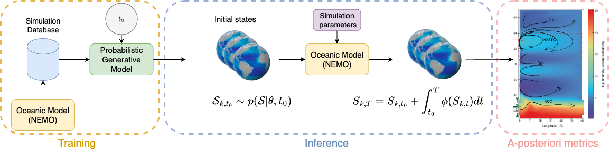

# DINO-Fusion Diffusion Model

Companion code to :

Meunier, E., Kamm, D., Gachon, G., Lguensat, R., & Deshayes, J. (2025). Learning to generate physical ocean states: Towards hybrid climate modeling. arXiv preprint arXiv:2502.02499.



## Features

- DDPM-based image generation
- Distributed training support via Accelerate
- Customizable U-Net backbone
- Support for various constraints during generation
- Flexible learning rate scheduling
- Wandb logging integration

## Installation

```bash
pip install torch diffusers accelerate wandb
```

## Usage

### Training

To train the diffusion model:

```bash
python train.py
```

Key training configurations can be modified in `configs/base_config.py`. Important parameters include:

- `train_batch_size`: Batch size for training
- `num_epochs`: Number of training epochs
- `learning_rate`: Initial learning rate
- `output_dir`: Directory for saving model checkpoints and generated samples
- `data_file`: Path to training data
- `fields`: Data fields to use for training

### Generating Images

To generate images using a trained model:

```bash
python generate_images.py \
    --model_path path/to/trained/model \
    --batch 8 \
    --inf_steps 1000 \
    --seed 42 \
    --constraints zero_mean gradient_zero_mean
```

Arguments:
- `--model_path`: Path to the trained model directory
- `--batch`: Number of images to generate (default: 8)
- `--inf_steps`: Number of denoising steps (default: 1000)
- `--seed`: Random seed for reproducibility (default: 0)
- `--constraints`: List of constraints to apply during generation

Available constraints:
- `zero_mean`
- `gradient_zero_mean`
- `border_zero`

Generated images will be saved in the model directory under `inference/`.

## Examples

Training with default configuration:
```bash
python train.py
```

Generating 16 images with zero mean constraint:
```bash
python generate_images.py \
    --model_path outputs/model_checkpoint \
    --batch 16 \
    --constraints zero_mean
```

## Project Structure

- `DiffusionModel.py`: Main diffusion model implementation
- `train.py`: Training script
- `generate_images.py`: Image generation script
- `configs/`: Configuration files
- `pipelines/`: Custom pipeline implementations
- `backbones/`: Neural network architectures
