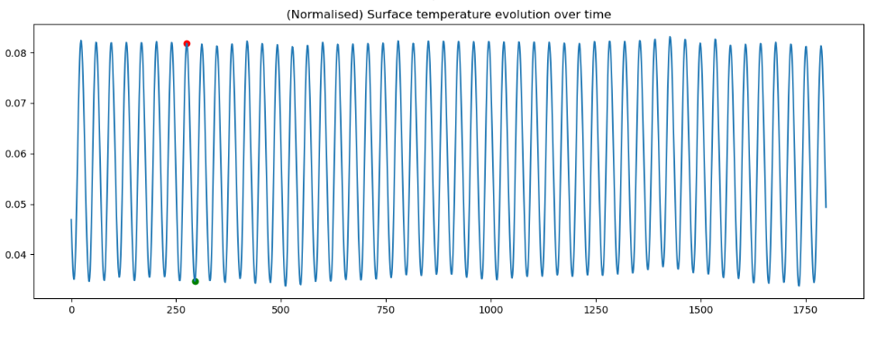
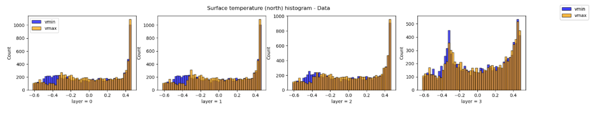
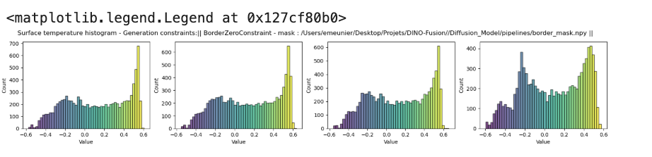
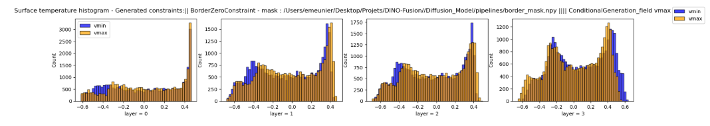
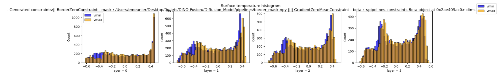

# Conditioning and Data-Assimilation

The goal of this set of experiments is to stufy if we can introduce conditioning over the state or a part of the state to do some kind of data-assimilation using our generative model. 

## Temperature histograms 

1. Data 

2. Generation without constraints (Just border 0)

3. Generation with conditioning + no constraints 

4. GradientZeroMeanConstraint

On a une bonne génération sur certaines valeurs initiales mais sur d'autre un état assez bizarre 

