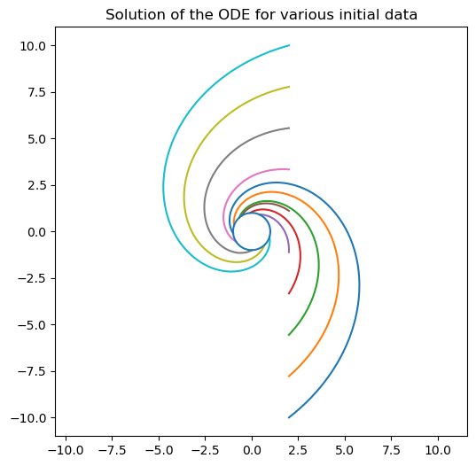
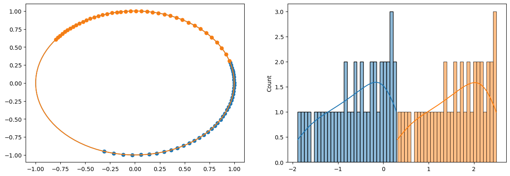
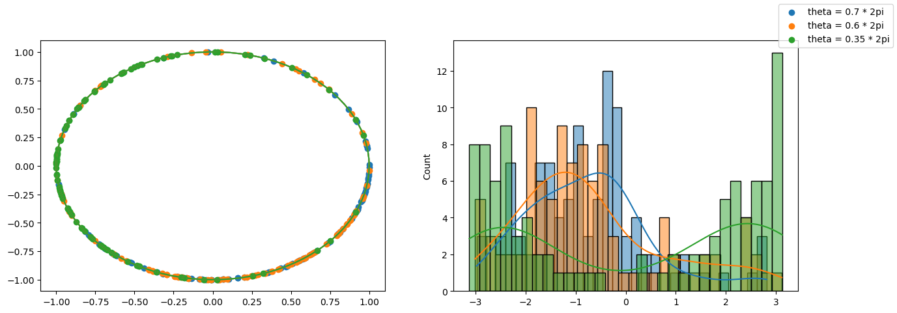

# Simple demonstrative example : 

In the initial work we learn to sample states (like oceanic states) from the stable distribution of the model while respecting physical constraints (by forcing the state to respect them). I would like to have an example to demonstrate that method and especially the fact to condition on external variables / generate new distributions. 

An initial example we though about is a problem based on ODE is this one : 

This is an ODE where idependently of the initial trajectory the final one will be on a given circle. The initial idea was to train a diffusion model condition on the initial state to see if it can generate final state of the distributionwhile respecting the constraint. 

Although one issue is that this problem is deterministic, in order to justify the usage of the diffusion model we need to have different possible states so we can output a distribution.

Different leads we have to modify this example could be : 

- A stochastic ODE that have slightly different stable state from the same initial state 
- Have an ODE that end up with a "distribution" of stable states like we have for ocean
- Have a noisy observation of the initial state that justify the need for a distribution for stable state
- Take a conditioning that is less direct that initial state that justify the fact to have a distribution

Another option would be to try to predict : 
$$
\mathbb E_{r_{init}}[p(z_{stable} | \theta_{init})]
$$
I am not sure of the notation but in practice it means prediction

Thus we could try to train the network to predict the distribution of final state conditionned by $\theta_{init}$ and given a distribution of $r$.

This way it's still a probabilistic problem and we can learn to predict a conditional distribution (conditionned on theta) + we have the respect of the cosntrain with the circle. 

So the idea is to first train a diffusion model with the distribution of one of $\theta_{init}$ and then 