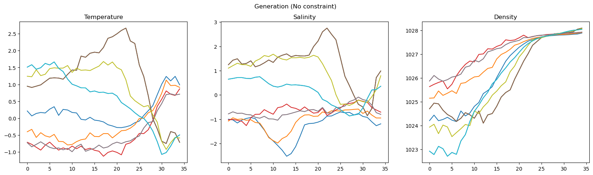

$$
\newcommand{\E}{\mathbb E}
$$

# Narrative presentation M2Lines

### Data

This is the true profiles for our problem : 

(Fig 1)

As we can see all profiles are monotically  increasing + we have different region of profiles.  We would like to reproduce that. 

#### Initial sampling scheme

The sampling we were doing 
$$
\min_q KL(p || q) + \rho (\E_q[\frac{1}{|\Omega|}\sum_{x_i \in \Omega} g(x_i)] - \mu)^2 + \lambda^T (\E_q[\frac{1}{|\Omega|}\sum_{x_i \in \Omega} g(x_i)] - \mu)
$$
Where $g(x) : \R^{2 \times K} \to \R^{2 \times K}$ is the density function (figure) and $\mu$ the average profile. 

### Small example

In order to better understand the impact of our constraint we train a simple diffusion model that generate $T, S$ profiles. Our first generation without constraint leads to : 

Where gthe profiles represent (well ?) the different classes but have issue in increasing density. 

**<u>First constraint</u>**

In this setup we can represent our constraint as the impact over the batch and thus formulate it as : 
$$
\min_q KL(p || q) + \rho (\E_q[g(x)] - \mu)^2 + \lambda^T (\E_q[g(x)] - \mu)
$$
(TODO : fix formulation + lagrangian)

It is like considering that our model is supposed to represent in distribution the temperature and salinity profiles of oceanic simulation. Applying this constraint leads to : 

(Fig. 2 )

In this setup the constraint have almost no impact that the average profile over the batch was already pretty much aligned to the profile of the data. Thus we stilll have issue with density decrease. 

**<u>Constraint on the variance :</u>** 
$$
\min_q KL(p || q) + \rho (\E_q[(g(x) - \mu)^2]) + \lambda^T (\E_q[g(x)] - \mu)
$$
Basically one term is conditioning the average variance and the other one the variance in this setup it doen.. -> two constraint problem. This lead to "density profile" (Fig)

Here all the profile are close to the average one. 

If we look at the update here -> show update 

we can show that it's equivalent to projecting on the average profile and taking the distance to projection 

....

which anount to decouple the optimisation 

..... (TODO : that's the part we should work on )

**<u>Projection constraint 1: clustering state</u>** 

**<u>Projection constraint 2 : Isotonic constraint</u>** 

Projection to the closest isotonic state

