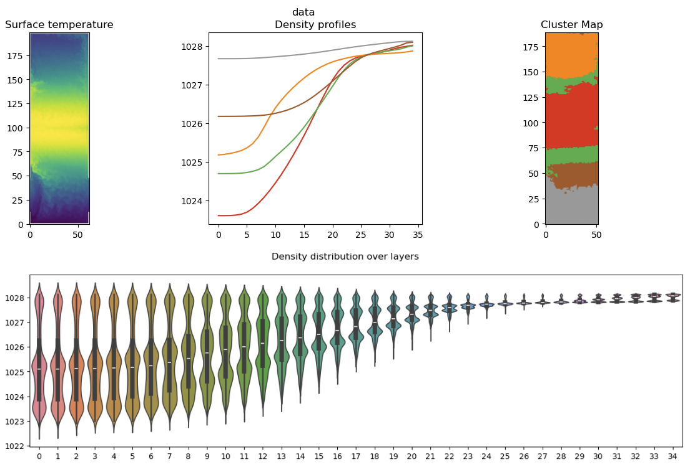
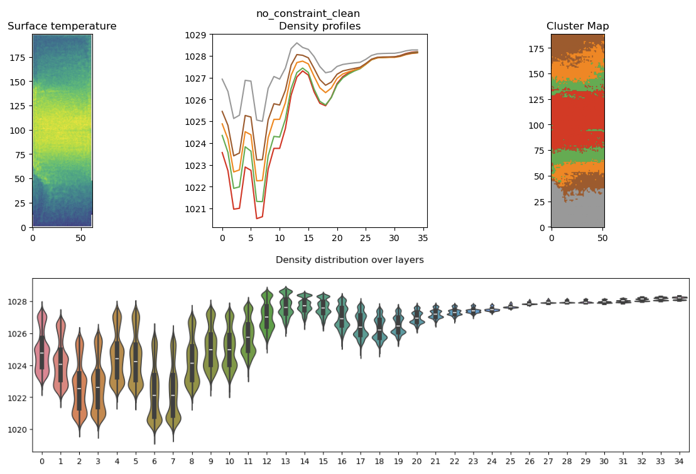
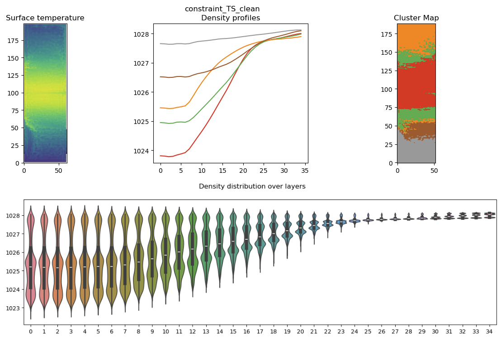
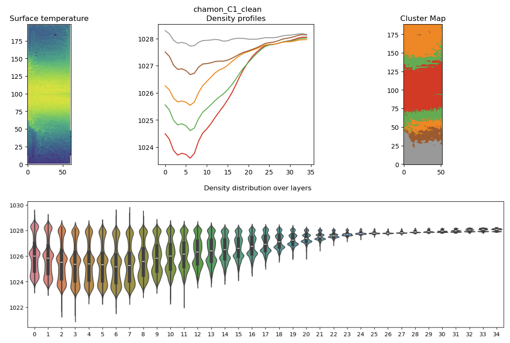
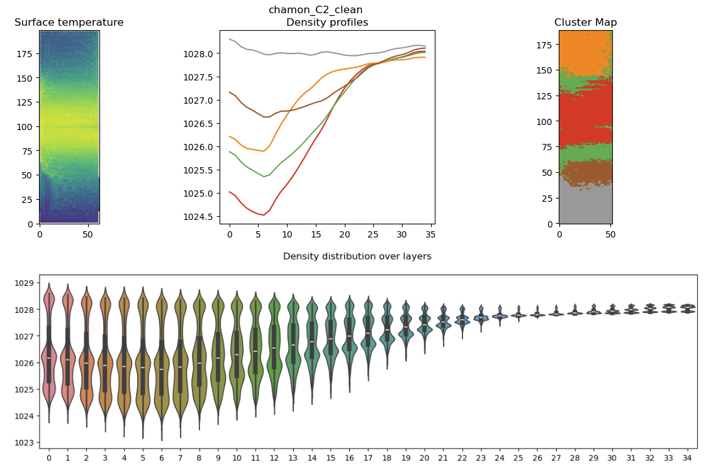
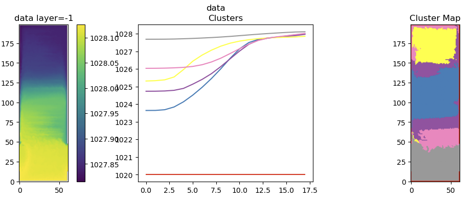
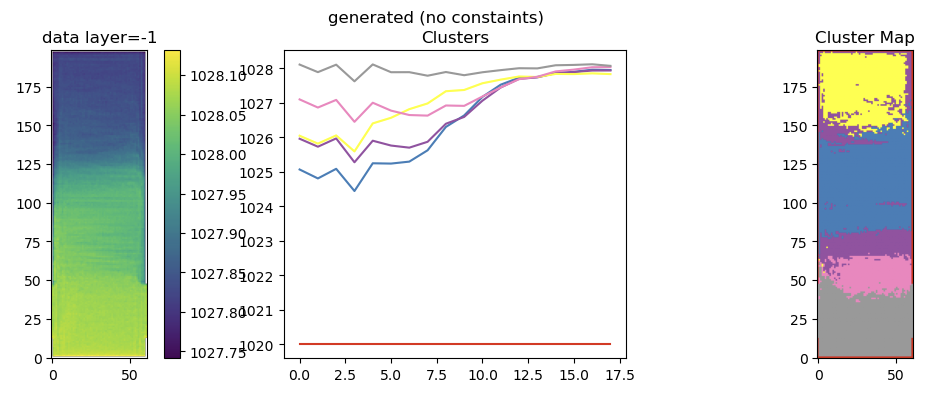
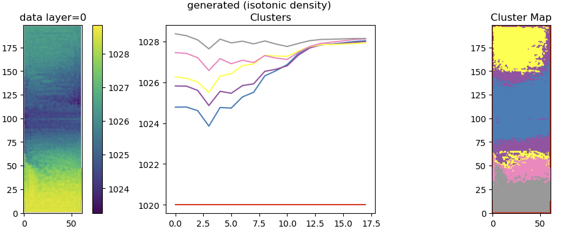

# Generated files profiles 

http://localhost:8888/notebooks/Results/notebooks/plot-density-profiles.ipynb

If we look at a field from data and the cluster the density we get regions like that : 

## Generated

-> Constraints manage to keep the structure of the state (cluster map over density profiles), which is great

# Generate with isotonic constraint 

Good point : density at bottom is good, less good : density at surface is shifted

Le problème qu'on a sur la génération de profils isotoniques c'est 

	- La densité a la surface paraît trop haute 
	- On arrive pas a faire respecter la croissance monotone 
	- C'est peut etre a cause des hyperparametres mais on sait pas 

-> Est ce qu'on devrait pas continuer a travailler sur l'algorithme / la selection des hyperparametres ? 
